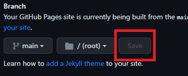

# Caribbean trainings page template

This repository is a website set up on [`github-pages`](https://pages.github.com/)
### Setting up the github-page

1. To set up the `github-pages`, in your new repository, go to `Settings` and then `Pages`. Select the branch you want to use for the website. Usually it is `main`.

2. Then, hit `Save`.

3. Go back to your repository's main page, and click on the gear icon next to `About` on the right side.

4. Under `Website`, check the option "Use your GitHub Pages website" and click on `Save changes`. Now you can see the URL on the repository's main page.

5. Open it to see how it looks like at this first moment. It will look like the `caribbean-trainings` page.

The following changes will reflect how your github page looks like.

3. Under the `_includes` folder, you will find two files. You don't need to worry about the `head.html` file. In the `head_custom.html` file, you can change the favicon that shows up next to the website description when you have the website open in a tab:

Currently, the file is SIG's favicon, but you can change it to your organization's favicon. To change it, update the file name in `href="images/favicon.ico"`. Note: you will need to add a new file containing the favicon in the `images` folder, or replace the existing `favicon.ico` file if you intend to use the same file name.

6. You can use the [Tables Generator](https://www.tablesgenerator.com/markdown_tables) to update the workshop `Agenda` in the `index.md` file (easier when you have a table already, e.g. on a doc or spreadsheet): 
